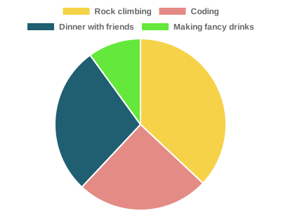

👋 Hello, I'm **Benjamin Coe**

I'm a Product Manager at sentry.io.

Outside of work, I'm a core contributor to [Node.js](https://github.com/nodejs/node), work on the code coverage tool [c8](https://github.com/bcoe/c8), and
maintain the argument parser [yargs](https://github.com/yargs/yargs).

Here's how I spend my time on any given week,

